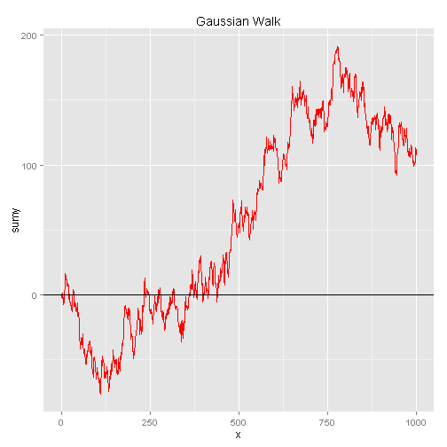
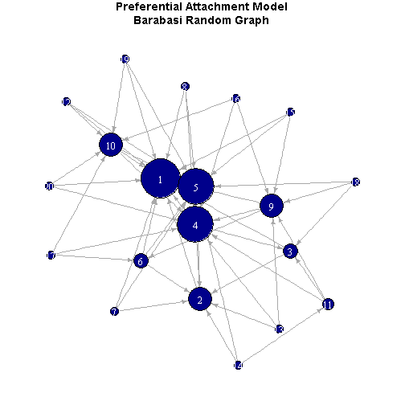

## Testing Impress.js 

Using *slidify* in **R**

--- .class #id 

### Regular plotting


```r
x <- rnorm(1000,0,5)
plot(cumsum(x),main="Gaussian Walk",col='red',
     ylab=expression(Sigma[t]*x[t]),
     xlab='t',type='l')
abline(h=0,col='black')
```

 

--- .class #id 

## GGPLOT2

 

--- .class #id

## Run Some Tests

```r
adft <- adf.test(x = cumsum(x),alternative = 'stationary')
print(adft)
```

```
## 
## 	Augmented Dickey-Fuller Test
## 
## data:  cumsum(x)
## Dickey-Fuller = -3.02, Lag order = 9, p-value = 0.1465
## alternative hypothesis: stationary
```

--- .class #id

## Formulae

1. **$Y=X\beta + \epsilon$**
2. $\frac{-\beta \pm \sqrt{\beta^2-4\alpha\gamma}}{2\alpha}$

--- .class #id

## iGraph


```r
g <- barabasi.game(n = 20, power = 1.1, m = 3, directed = T)
par(mar=c(.5,.5,2.2,.5))
plot.igraph(g, layout=layout.fruchterman.reingold,
            vertex.size=degree(g)*2,edge.arrow.size=.5,
            edge.color='dark gray',vertex.color='dark blue',
            vertex.label.color='white',
            main="Preferential Attachment Model\nBarabasi Random Graph")
```

--- .class #id

## iGraph

 

